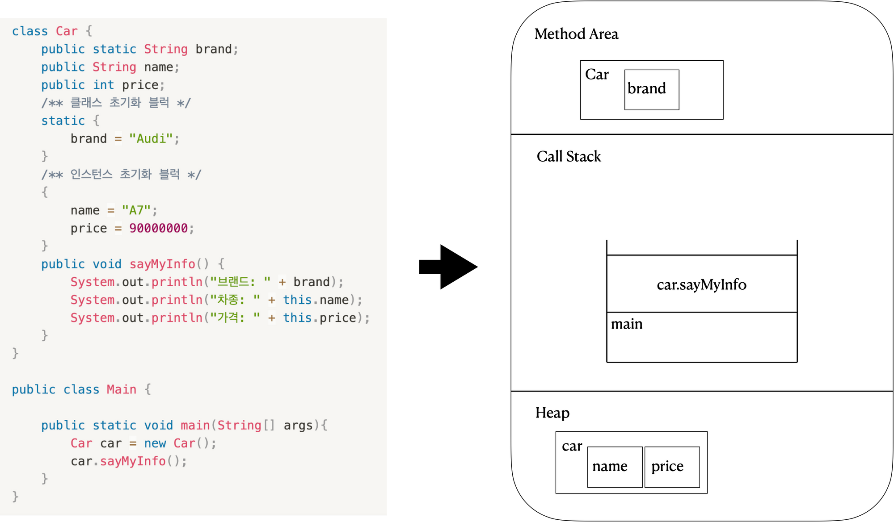

# JVM이란?

- Java Virtual Machine의 약자로 자바를 실행하기 위한 자바 가상머신이다.
- 자바와 운영체제 사이에서 중계자 역할을 하며, 자바가 운영체제 상관없이 실행 가능하도록 한다.
- 운영체제 위에서 동작하는 프로세스로 자바 코드를 컴파일 해서 얻은 바이트 코드를 해당 운영체제가 이해할 수 있는 기계어로 바꾸어 실행 시켜주는 역할을 한다.
- Garbage Collection을 이용하여 자동으로 메모리 관리를 해준다.

# JVM의 메모리 구조

JVM은 크게 3가지의 영역으로 나누어 볼 수 있다.

1. Method Area
2. Call Stack
3. Heap

### Method Area

프로그램 실행 중 어떤 클래스가 사용되면, JVM은 해당 클래스의 클래스파일을 읽어와 분석하여 클래스에 대한 정보를 이곳에 저장한다. 이 때, 해당 클래스의 클래스 변수도 이 영역에 함께 생성된다.

### Call Stack

Call Stack은 메서드의 작업에 필요한 메모리 공간을 제공한다. 메서드가 호출되면, Call Stack에 호술된 메서드를 위한 메모리가 할당되며, 이 메모리는 메서드가 작업을 수행하는 동안 지역변수들과 연산의 중간결과 등을 저장하는데 사용된다. 그리고 메서드가 작업을 마치면 할당되었던 메모리 공간은 반환되어 비워진다.

### Heap

인스턴스가 생성되는 공가이다.

프로그램 실행 중 생성되는 인스턴스는 모두 이곳에 생성된다. 즉, 인스턴스 변수들이 생성되는 공간이다.

위 구조를 그림으로 보면 아래와 같다.

각 공간별로 보면 다음과 같다.

- Methoa Area
    - Car 클래스가 실행되면서 적재되었다.
    - Car 클래스의 클래스변수인 brand 또한 적재되었다.
- Call Stack
    - main코드를 보면 new Car()를 통해 인스턴스를 생성하고 car의 sayMyInfo메서드를 호출하였다.
    - 따라서 sayMyInfo메서드 작업을 위해 메모리 공간을 확보하고 CallStack에 메서드가 적재된다.
- Heap
    - main코드를 보면 new Car()를 통해 인스턴스를 생성하였다.
    - 따라서 Heap공간에 car 인스턴스가 적재되었다.
    - 멤버변수인 name, price 또한 초기화 되고 car인스턴스와 같이 적재되었다.

생각해보기

기본형과 참조형의 차이가 JVM구조와 메서드 호출에서 어떻게 구분되는지 생각해보기.

---

지역변수 생명 주기 및 함수 호출 등에 의한 Call Stack변화는 추후 추가 생각중.

++JIT, JDK, JRE 등...